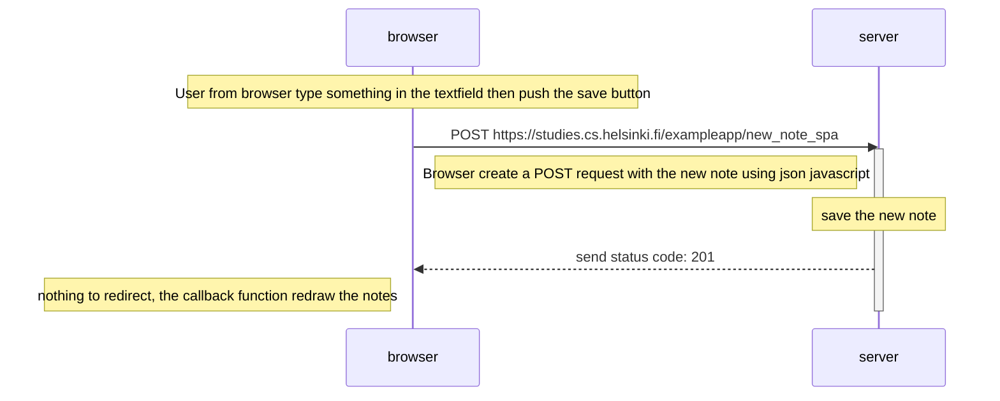

```mermaid
sequenceDiagram
    participant browser
    participant server

    Note over browser: User from browser type something in the textfield then push the save button
    browser->>server: POST https://studies.cs.helsinki.fi/exampleapp/new_note_spa
    activate server
    Note right of browser: Browser create a POST request with the new note using json javascript
    Note over server: save the new note
    server-->>browser: send status code: 201
    note left of browser: nothing to redirect, the callback function redraw the notes
    deactivate server
```

